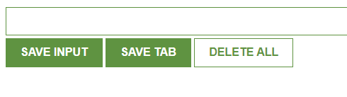

# Scrimba Marco

[Scrimba](https://scrimba.com/allcourses) for me was the best course I have taken.  
I found great teachers who taught me a lot of concepts and made me love this industry even more. 

[Certificate]()

---

## Projects :

- <a href="#htmlcss">HTML & CSS</a>

  - <a href="#landingpage">Landing Page </a>
  - <a href="#portfolio1">Portfolio 1 </a>
  - <a href="#portfolio2">Portfolio 2 </a>
  - <a href="#page1">Page flex </a>
  - <a href="#page2">Page grid </a>
  - <a href="#card1">Card flex </a>
  - <a href="#card2">Card grid </a>

- <a href="#js">JavaScript</a>

  - <a href="#blackjack">Blackjack</a>
  - <a href="#catmeme">Catmeme</a>
  - <a href="#cookie">Cookie</a>
  - <a href="#emoji">Emoji</a>
  - <a href="#extension">Extension</a>
  - <a href="#rpg">RPG Game</a>
  - <a href="#twitter">Twitter Clone</a>
  - <a href="#wargame">War Game</a>
  - <a href="#dashboard">Dashboard</a>
  - <a href="#password-generator">Password Generator</a>
  - <a href="#color-scheme">Color Scheme</a>

- <a href="#react">React</a>

  - <a href="#capstone">Capstone Project</a>
  - <a href="#router">React router</a>
  - <a href="#speedgame">Speed typing game</a>
  - <a href="#form">React Form</a>
  - <a href="#prj1">Basic Project 1</a>
  - <a href="#prj2">Basic Project 2</a>
  - <a href="#prj3">Basic Project 3</a>
  - <a href="#prj4">Basic Project 4</a>
  - <a href="#prj5">Basic Project 5</a>
  - <a href="#prj6">Basic Project 6</a>
  - <a href="#prj7">Basic Project 7</a>

---

# 
HTML & CSS

### 
  Landing Page

---

### 
  Portfolio 1

---

### 
  Portfolio 2

---

### 
  Page flex

## 

### 
  Page grid

### 
  Card flex

---

### 
  Card grid

---

# 
JavaScript

### 
  Blackjack 

---

### 
  Catmeme 

---

### 
  Cookie 

---

### 
  Emoji 

---

### 
  Emoji 

---

### 
  RPG Game 

---

### 
  Twitter clone 

---

### 
  War Game 

---

### 
  Dashboard 

---

### 
  Password generator 

---

### 
  Color Scheme 

---

# 
React

### 
  Capstone project 

---

### 
  React Router

---

### 
  Speed typing game

---

### 
  React Form 

---

### 
  Basic project 1

---

### 
  Basic project 2

---

### 
  Basic project 3

---

### 
  Basic project 4

---

### 
  Basic project 5

---

### 
  Basic project 6

---

### 
  Basic project 7

---
